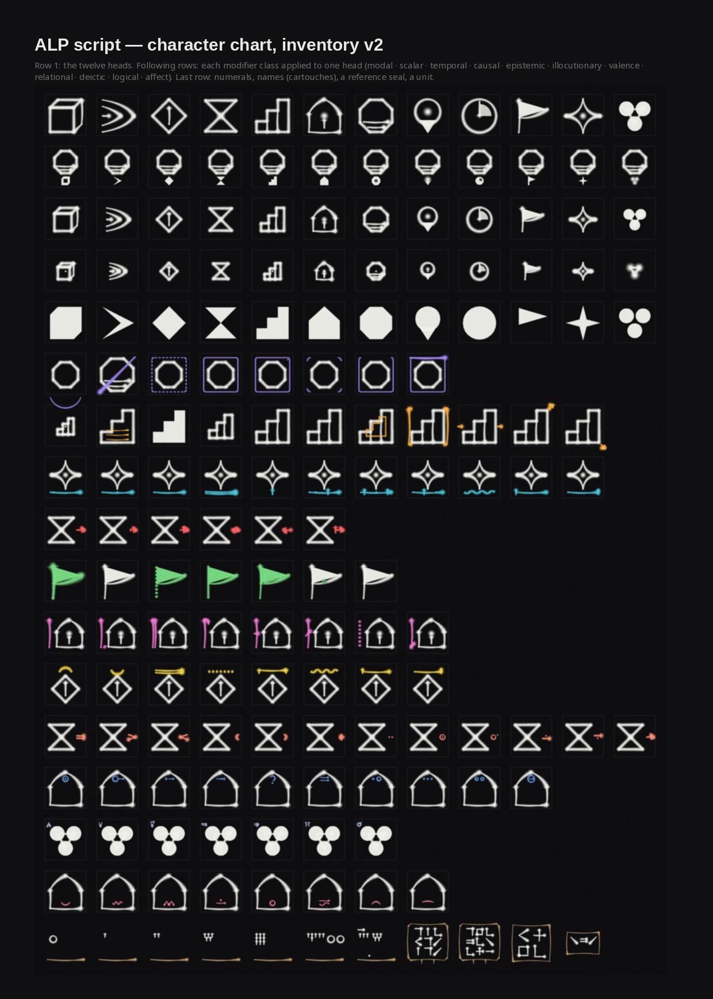
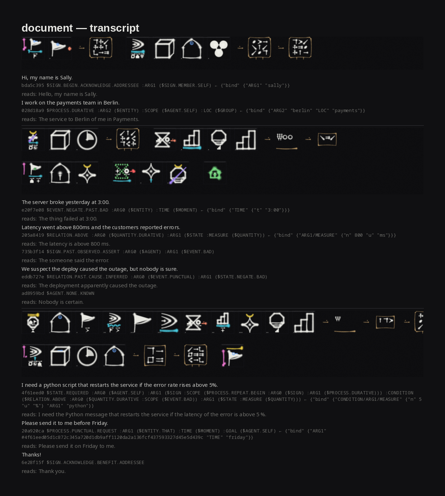
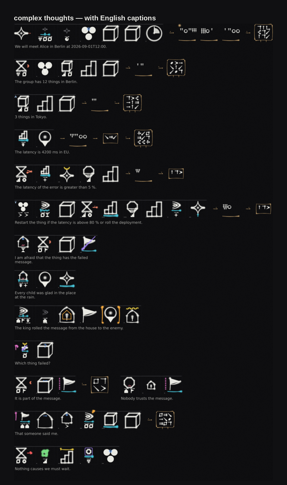

# ALP — an experiment in a written language for machines


*Three characters, written stroke by stroke. Read left to right: a relation — dashed because it's inferred,
doubled because it's disputed, red arrow for "causes" — between a past
instantaneous event and a negated, bad state. In English: "the deploy is the
suspected, disputed cause of the outage."*

## The idea

What if agents didn't talk to each other in English?

English is expensive to store, ambiguous to read back, and tied to whichever
model wrote it. Binary schemas are cheap but brittle — change the schema and
every old message goes dark. ALP is an attempt at a third thing: a language
where **meaning is composed from a small closed set of primitives**, every
composed symbol is **identified by the hash of its own definition**, and the
whole thing has a **script** so a human can look at a transcript and see the
structure without a decoder.

- 12 kinds of thing (entity, process, property, relation, quantity, agent,
  state, place, moment, sign, event, group) …
- … qualified by a hundred-odd primitives in classes that behave differently:
  modality, degree, time, cause, certainty, speech act, value, relation,
  deixis, logic, feeling …
- … arranged into trees with ordered roles (agent, patient, where, when, why …).
- Names, numbers, dates and measurements are *data bound to a role*, never
  part of the symbol — so the symbols stay universal and the specifics ride
  alongside.
- The symbol's identity is `sha256(its canonical tree)`. Two agents who compose
  the same meaning get the same identifier without ever having met. Nobody
  assigns numbers; nothing can be renamed out from under a stored message.
- Conversations are append-only causal event streams: join, assert, amend the
  lexicon, ask about an unknown symbol, answer, repair a misunderstanding,
  checkpoint. Any participant can be swapped for a different model mid-stream
  and pick up from the last checkpoint.

The spec this grew out of is in [`docs/rfc-alp-001.pdf`](docs/rfc-alp-001.pdf).
The implementation here goes further than the spec in places (inventory v2,
literals, the script) and the spec is honest about what's unsolved (§12.6:
two agents can compose the *same* idea two different ways and never notice).
That's part of why it's an experiment.

## The script

One composition is one square character, built the way hanzi are built —
components fused by position — rather than by stringing glyphs in a row. The
head shape says what kind of thing it is; everything else transforms it:

| what | how it shows |
|---|---|
| certainty | the head's stroke: heavy = known, dashed = inferred, dotted = unknown, doubled = disputed |
| degree | the head's size and fill |
| modality | an enclosure around the head; a slash through it is negation |
| value | a crown above (arc up = good, arc down = bad, zigzag = harm …) |
| time | the ground line it stands on (dot left = past, centre = now, right = future) |
| speech act | a radical on the left |
| cause / relation | a connector on the right |
| who / feeling | small marks inside |
| arguments | half-size heads in a row beneath |

Each class has its own colour, strokes are drawn with brush pressure, and
names come out as cartouches. Here is the whole character chart — the twelve
heads, how they scale, and every class applied to a head it suits:



And an ordinary paragraph — *"Hi, my name is Sally. I work on the payments team
in Berlin. The server broke yesterday at 3:00…"* — as script, with the
translator's trees and the realizer's readings underneath:



## Options worth knowing

The same text can be shown several ways; all of these are flags on `render`,
`transcribe`, `animate` and friends.

| flag | effect |
|---|---|
| `--captions` | the realizer's English set under each word, so a page reads bilingually — [`04b-complex-captions.png`](examples/output/04b-complex-captions.png) |
| `--english --style each` | one utterance per row with source sentence, tree, bound values and reading |
| `--palette default\|neon\|ember\|ocean\|mono` or a JSON file | the class colours are language configuration, not a hard-coded theme — [`15-palettes.png`](examples/output/15-palettes.png); `ALP_PALETTE` sets a default |
| `--ink crisp\|medium\|soft` | how much brush blending and grain |
| `--theme dark\|light`, `--mono`, `--frame off`, `--cell N` | background, colour on/off, em-box, size |
| `animate --mode write` | characters written stroke by stroke ([`10-one-word.gif`](examples/output/10-one-word.gif)) |
| `animate --mode pulse` | the finished word alive: colours cycle through the palette and the ink breathes — loops ([`13-pulse.gif`](examples/output/13-pulse.gif)) |
| `animate --mode trace` | a highlight travelling along the strokes in writing order — loops ([`14-trace.gif`](examples/output/14-trace.gif)) |
| `animate --title-sequence` | a short film: title, the twelve heads, the sentence ([`12-title-sequence.mp4`](examples/output/12-title-sequence.mp4)) |



## What works today

- A canonical binary encoding and a lossless text form that round-trips
  byte-for-byte, with hashes, causal ordering and a stateless fold.
- A runnable peer: two agents actually converse, buffer what they don't know,
  ask, answer, verify each other's checkpoints, and converge
  (`examples/two_agents.py`).
- English in: a rule-based translator that turns sentences into trees and binds
  the names and numbers. English out: a realizer that reads trees back into
  sentences. Both are scaffolding, not understanding — the language and the
  script are the point.
- The script, rendered to PNG, PDF and SVG, with a chart and a key — and
  **animated**: characters are written stroke by stroke to GIF or MP4
  (`alp animate`), including a short title sequence
  ([`12-title-sequence.mp4`](examples/output/12-title-sequence.mp4)) and a
  whole letter being written ([`11-document-written.mp4`](examples/output/11-document-written.mp4)).

```sh
uv sync
uv run alp translate "we suspect the deploy caused the outage"
uv run alp render -f yourtext.txt --png out.png
uv run alp transcribe -f letter.txt -o out/
uv run alp chart --png chart.png
uv run alp animate "the server broke yesterday" --gif out.gif --mp4 out.mp4
uv run python examples/two_agents.py
```

More in [`examples/output/`](examples/output/) and the
[language reference](docs/language-reference.md).

## What's not finished, and where it could go

This is a prototype. Things we know are rough or open:

- **The English front end** is rules and lexicons. It handles a lot of
  ordinary sentences and falls over on others; the transcripts show you when.
- **The script has no font yet.** It is drawn procedurally; there is a
  per-character SVG exporter as a starting point.
- **Synonymy forking** (the same idea composed two ways) is unsolved in the
  spec. There's a structural near-duplicate scan, which is a mitigation, not a
  fix.
- **Is 12 heads and ~120 primitives enough?** Nobody knows yet. Inventory v2
  added relation, deixis, logic and affect because the first version couldn't
  say *who*, *how many*, *compared to what* or *how it feels*.
- **Would models actually read this better than English?** Untested. The spec
  itself says the script buys human audit, not token savings.

If any of that sounds like something you'd want to push on — a font, a better
parser, a real evaluation with models on both ends, a different inventory — the
code is small enough to read in an afternoon.
[`docs/script-design-notes.md`](docs/script-design-notes.md) records the design
reasoning so far, including what was borrowed from hanzi, cuneiform and
hieroglyphs and what was deliberately left out.

## Layout

```
src/alp/     alpb (codec) · inventory · composition · script (the characters) · anim · translate · realize
             events (streams) · peer (a participant) · alpt (text form) · svg · render · cli
docs/        RFC-ALP-001, language reference, script design notes
examples/    example texts, the two-agent demo, generated output
tests/       pytest
```

MIT. It's an experiment — take it somewhere.
