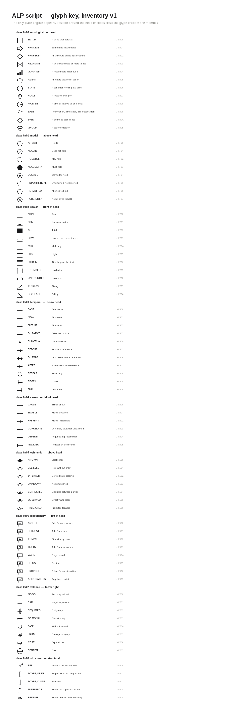

# alp — Agent Lexicon Protocol toolkit

A Python implementation of **RFC-ALP-001 v1.1** (`docs/rfc-alp-001.pdf`): a
compound, aggregative language for machine agents.  Meaning is composed from a
closed inventory of **76 semantic primitives** into trees with ordered roles;
each composed symbol is identified by the hash of its tree; symbols travel over
an append-only causal event stream; and the whole thing has a written
**script** in which a symbol renders as one visual block.



## What English becomes

```
$ alp translate "We suspect the deploy caused the outage."
eddb727e  $RELATION.PAST.CAUSE.INFERRED :ARG0 ($EVENT.PUNCTUAL) :ARG1 ($STATE.NEGATE.BAD)

$ alp translate "If the error rate rises, page the on-call engineer."
477d2d30  $SIGN.PUNCTUAL.WARN :ARG1 ($AGENT) :CONDITION ($PROCESS.INCREASE :ARG0 ($QUANTITY.DURATIVE :SCOPE ($EVENT.BAD)))
          bound:   ARG1='on-call'
```

A sentence becomes a **tree of primitives**: noun phrases are nodes, adjectives
and tense attach to the noun they qualify, prepositions become roles, causal
and conditional connectives become `RELATION` nodes or `CONDITION` roles.
**English never enters the symbol.**  Proper names and unknown words are bound
as *data* at ASSERT time (§5.4) — `on-call` above is a value attached to the
symbol, not part of it — so the lexicon is built from primitives alone.  The
one metric that matters is the *English leakage rate* the tool prints with
`--stats`.

The same tree drawn in the script (`alp render '...' --png`):


Head glyph in the centre; modal/epistemic marks above; causal/illocutionary
left; scalar right; valence lower-right; temporal below; `NEGATE` is the one
mark that crosses the head; roles descend beneath as ordered slots (nested
compositions render as nested blocks).  No letters, one ink.  English appears
only in the [glyph key](examples/output/glyph-key.png).

## Examples you can look at

Everything in [`examples/output/`](examples/output/) is generated by
`sh examples/make_examples.sh`:

| File | What it is |
|---|---|
| [`glyph-key.png`](examples/output/glyph-key.png) / `.pdf` / [`glyph-sheet.svg`](examples/output/glyph-sheet.svg) | All 76 glyphs with name, sense, class position, PUA codepoint |
| [`urgency.png`](examples/output/urgency.png) [`deadline.png`](examples/output/deadline.png) [`outage.png`](examples/output/outage.png) [`escalate.png`](examples/output/escalate.png) [`root-cause.png`](examples/output/root-cause.png) [`blast-radius.png`](examples/output/blast-radius.png) | RFC Appendix A compositions as script blocks; `.txt` has SID, canonical bytes, reading |
| [`incident-script.png`](examples/output/incident-script.png) / `.pdf`, [`story-script.png`](examples/output/story-script.png) | Two English texts as script — blocks plus the normative ASCII transliteration, no English |
| [`incident-linear.png`](examples/output/incident-linear.png), [`story-linear.png`](examples/output/story-linear.png) | The §6.4 fallback: the same symbols as a linear glyph strip |
| [`incident-script-with-english.png`](examples/output/incident-script-with-english.png), [`story-script-with-english.pdf`](examples/output/story-script-with-english.pdf) | Same, with the source sentence and a generated reading beside each block (`--english`) |
| [`incident-translation.txt`](examples/output/incident-translation.txt), [`story-translation.txt`](examples/output/story-translation.txt) | Trees, bound names, leakage stats |
| [`incident.alpb`](examples/output/incident.alpb) → [`incident.alpt`](examples/output/incident.alpt) | A 22-event ALP/B stream (SID-128) and its lossless ALP/T projection |
| [`incident-archive-sid256.alpt`](examples/output/incident-archive-sid256.alpt) | Re-profiled to SID-256 for archival (§3.5) |
| [`incident-audit.pdf`](examples/output/incident-audit.pdf) / `.png` | Stream audit: every event, its blocks, the ALP/T |
| [`incident-decoded.txt`](examples/output/incident-decoded.txt) | ALP → English (stored glosses, then generated readings) |
| [`incident-verify.txt`](examples/output/incident-verify.txt) [`incident-stats.txt`](examples/output/incident-stats.txt) [`incident-forks.txt`](examples/output/incident-forks.txt) | Hash/canonical/round-trip check, sizes, synonymy-fork scan |
| [`appendix-d.alpt`](examples/output/appendix-d.alpt) / `.alpb` / [`.pdf`](examples/output/appendix-d.pdf) / `.png` | The RFC's worked 23-event conversation with real hashes: concurrent fork, REGROUND repair, CHECKPOINT, model substitution |

## Install and run

```sh
uv sync
uv run alp --help
uv run pytest                                    # 48 tests: RFC reference SIDs, byte-level round trips, glyphs, CLI

uv run alp translate "urgency is high" --stats   # English -> tree
uv run alp render -f notes.txt --png notes.png   # English -> script image   (--english adds the key, --pdf, --linear)
uv run alp encode -f notes.txt -o notes.alpb --png notes.png --pdf notes.pdf --stats
uv run alp export notes.alpb -o notes.alpt       # ALP/B -> ALP/T (lossless; import gives identical bytes)
uv run alp import notes.alpt -o again.alpb
uv run alp decode notes.alpb --events            # ALP -> English
uv run alp verify notes.alpt
uv run alp compose '$STATE.NEGATE.NOW.BAD :SCOPE $PROCESS' --png outage.png
uv run alp key --png key.png --svg glyphs.svg
uv run alp forks notes.alpb                      # §12.6 synonymy-fork candidates
```

## Package

| Module | What it does |
|---|---|
| `alp.alpb` | Canonical ALP/B TLV codec (CBOR-shaped, §7.5), strict `E_NONCANONICAL`, REF kind 4 = PID |
| `alp.inventory` | The 76 primitives, classes, roles, PUA codepoints |
| `alp.composition` | Composition records, canonical form, SID, transliteration parser, English readings |
| `alp.glyphs` | The script: one stroke-program glyph per primitive; Pillow / SVG / PDF emitters |
| `alp.translate` | `Translator` (compositional, names bound as data) and `SimpleTranslator` (the RFC's Appendix E one) |
| `alp.events` | Frames, EIDs, causal DAG, frontier, fold with EID tiebreak, CHECKPOINT digests, profiles, `reprofile` |
| `alp.alpt` | ALP/T writer + parser, byte-identical round trip, SID/EID mismatch detection |
| `alp.lexicon` | Structural near-duplicate scan for synonymy forks (§12.6) |
| `alp.render` | Blocks per §6.2, linear fallback per §6.4, glyph key; PNG (Pillow) and PDF (reportlab) documents |
| `alp.cli` | `translate encode decode export import verify render compose key forks lexicon stats inventory` |

```python
from alp import Composition, Translator, Stream, alpt, render

(t,) = Translator().translate("We suspect the deploy caused the outage.")
t.composition.transliterate()   # '$RELATION.PAST.CAUSE.INFERRED :ARG0 ($EVENT.PUNCTUAL) :ARG1 ($STATE.NEGATE.BAD)'
t.composition.sid_hex(8)        # 'eddb727e'
t.value                         # True  (no English bound)

s = Stream(sid_width=16)
s.join("a000", competence=list(alp.PRIMITIVES.values()))
s.amend("a000", [t.composition]); s.assert_("a000", [(t.composition, t.value)])
assert alpt.loads(alpt.dumps(s)).stream.to_bytes() == s.to_bytes()
render.save_png(render.doc_for_compositions([t.composition]), "blame.png")
```

## Implementation decisions

* **Gloss out of the hash, residue in** (§3.1); **roles ordered, modifiers a set** (§3.3); **inventory closed at 76** (§4.1) — asserted in code and tests.
* **Names are data, not residue.** The default translator binds proper names at ASSERT time so no English enters a symbol; `--names residue` gives the RFC's §5.5 behaviour, `--simple` the RFC's own front end.
* **EIDs hash the body as transmitted at the stream's profile**; `Stream.reprofile` / `alp export --archive` re-hash to SID-256 for storage.
* **Authors are symbols** (`$AGENT ~"name"`), announced in `JOIN.caps.agent` so they resolve from any projection.
* **ALP/T extensions** for losslessness: `profile`/`stream` header, `fl`/`sig` lines, `@hex` EID terms, `{k v}` maps, `>` raw-payload escape.
* **§12.6 synonymy forking** is unsolved in the RFC; `alp forks` is the partial mitigation that is actually buildable — a structural near-duplicate scan feeding REGROUND.
* **The script is procedural** — no OpenType font yet; `glyph-sheet.svg` is the starting point for one.

MIT licensed, like the specification.
