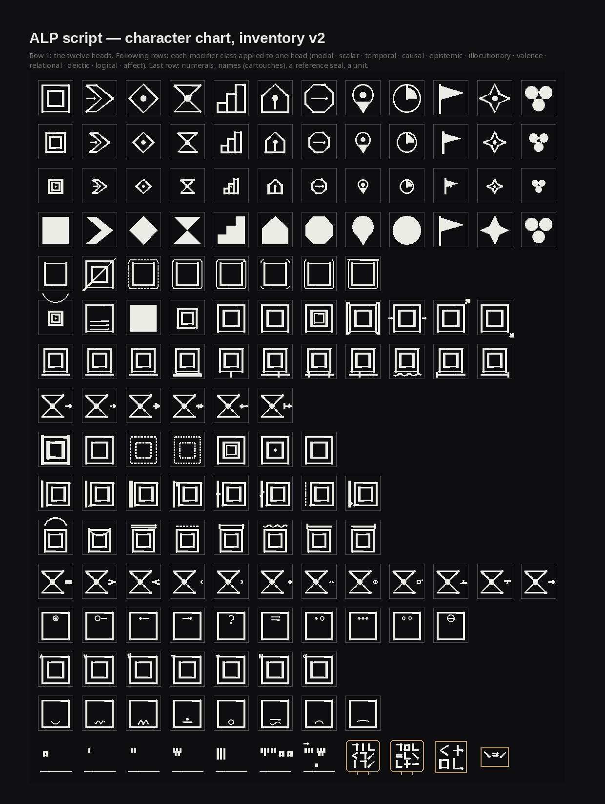
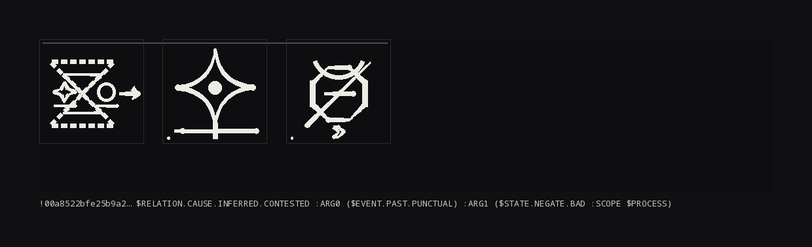
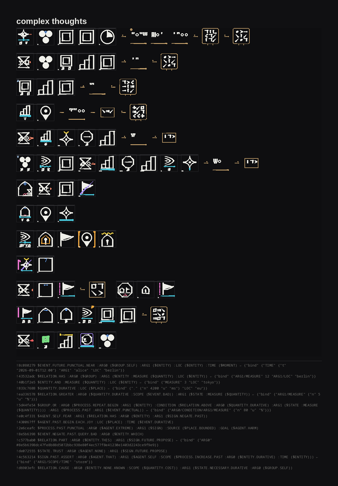
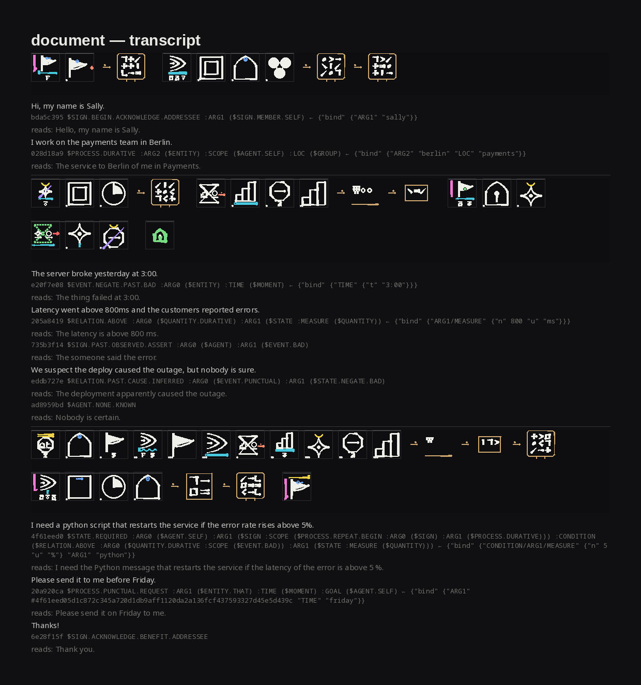

# alp — Agent Lexicon Protocol toolkit

A Python implementation of **RFC-ALP-001** (`docs/rfc-alp-001.pdf`): a compound,
aggregative language for machine agents.  Meaning is composed from a closed
inventory of semantic primitives into trees with ordered roles; each composed
symbol is identified by the hash of its tree; symbols travel over an
append-only causal event stream; and the language has a written **script** in
which one composed symbol is one character.



## The script

One composition = **one square character**, composed — not stacked — the way
hanzi fuse components by position, Egyptian quadrats pack a group into one
block, and cuneiform builds every sign from wedges.  The head radical (one of
twelve kinds of thing) sits in the centre and every modifier class transforms
it in its own way:

| class | what it does to the head |
|---|---|
| scalar | **scale and fill** — NONE tiny · LOW small · HIGH large · EXTREME doubled · ALL filled · SOME hatched · BOUNDED bracketed · UNBOUNDED open · INCREASE/DECREASE a rising/falling tip |
| epistemic | **stroke** — KNOWN heavy · INFERRED dashed · UNKNOWN dotted · CONTESTED doubled · OBSERVED eye · PREDICTED forward tip |
| modal | **enclosure** — NECESSARY box · POSSIBLE dashed box · HYPOTHETICAL corners · PERMITTED open-top · FORBIDDEN lidded · DESIRED box+dot · **NEGATE slashes the head** |
| valence | **crown** above — GOOD ^ · BAD v · REQUIRED = · OPTIONAL dashed · SAFE roof · HARM zigzag · COST/BENEFIT ticks |
| temporal | **ground line** the head stands on — dot left/centre/right = PAST/NOW/FUTURE · doubled DURATIVE · tick PUNCTUAL · end-stops BEGIN/END · reference bars BEFORE/DURING/AFTER |
| illocutionary | **left radical** (speech) — bar ASSERT · hook REQUEST · doubled COMMIT · top hook QUERY · tick WARN · crossed REFUSE · dashed PROPOSE · check ACKNOWLEDGE |
| causal / relational | **connector** on the right — arrows for causation; the relation's form for equal / greater / less / part / has / member / near / inside / … |
| deictic / affect | **inner marks** — upper: I / you / this / that / which; lower: joy / fear / anger / trust / … |
| logical | small marks at the top-left corner — and / or / xor / iff / implies / only / except |
| roles | ARG0 and ARG1 are seeds **inside the head's lobes**; other roles form a reduced row beneath, each seed with its role marker. A nested composition's own character follows (depth-first) — a composition is a short *word*, never a stack |
| literals | **numbers** as wedge counts · **names** as cartouches with a visual hash of the name · **times**, **units**, **reference seals** — bound values written after the word they bind to |

How a character is put together follows hanzi practice
([`docs/script-design-notes.md`](docs/script-design-notes.md) is the study):

* **One stroke set, modulated.** Every mark is a heng / shu / pie / na / dian /
  arc / wave with brush-like weight modulation (horizontals lighter than
  verticals, falling strokes tapering or swelling); weight never drops below
  1/22 em, so small characters keep their strokes.
* **Structure, not slots.** Bands exist only for the components present; the
  head takes the largest square that remains.  A bare head fills the box; a
  loaded one gives up space proportionally.  Crown, ground line, radical and
  connector are sized from the head and attached to its edge — nothing floats.
* **Ink budget.** A composition with more than six components is written as a
  two-character compound in a fixed split (head-shaping marks first,
  surroundings and roles second, the head shown as a seed), the way hanzi put
  complexity into more characters rather than denser ones.
* **Colour is a channel.** The head is in ink; each modifier class has a
  colour — modality violet, degree amber, time teal, cause red, certainty
  green, speech magenta, value gold, deixis blue, feeling pink, literals clay —
  so a mark's class is read before its shape (`--mono` for shape only).
* **Word headline** joins the characters of one word; a faint em-box is on by
  default in running text (`--frame off` to drop it).  `--svg` writes the same
  layout as vector; `alp.svg.character_svgs` gives one SVG per character for a
  font pipeline.

`examples/output/root-cause.png` — *"deploy 4471 is the suspected cause of the outage"*:



A whole text is a few lines of characters (`examples/output/complex-script.png`):



## Running the protocol

`alp.peer.Peer` is a participant, not just a serializer.  It buffers events
that name symbols it cannot resolve and emits EXPAND (§9.3), answers EXPAND
with GROUND under a rate limit (§11.4), verifies GROUND payloads against the
SIDs it asked for (§11.3), attests HELD on receipt and DEMONSTRATED after a
round-trip challenge (§9.2), emits CHECKPOINTs and verifies received digests
independently — E_DIVERGENCE / E_INVENTORY on mismatch (§7.3) — rate-limits
AMEND and caps the lexicon (§11.2), and handles model substitution with
DECLINED attestations (§9.4).  `examples/two_agents.py` runs two peers through
all of it and checks that their state digests converge:

```
$ uv run python examples/two_agents.py
events: alice=29 bob=29  lexicon: 8/8  converged: True  pending@bob: 0  declined@bob: 1
[bob] buffered ASSERT 5d3f403e: unknown ['037fac5d']
[bob] applied buffered ASSERT 5d3f403e
[bob] model replaced: 110 primitives, 0 symbols declined
```

## Transcribing a document

```
$ alp transcribe -f letter.txt -o out/
letter: 10 utterances in 3 paragraphs -> out/
```

writes `letter-script.png` (script only), `letter-transcript.png/.pdf`
(each paragraph as script, then every sentence with its tree and bound
values), `letter.alpt` / `letter.alpb` (the stream) and
`letter-transcript.txt`.  `examples/output/document-*` is the transcript of
[`examples/document.txt`](examples/document.txt) — *"Hi, my name is Sally. I
work on the payments team in Berlin. The server broke yesterday at 3:00 … I
need a python script that restarts the service if the error rate rises above
5%. Please send it to me before Friday. Thanks!"*:



## What English becomes

```
$ alp translate "We will meet Alice at 12:00 on 2026-09-01 in Berlin."
8c080279  $EVENT.FUTURE.PUNCTUAL.NEAR :ARG0 ($GROUP.SELF) :ARG1 ($ENTITY) :LOC ($ENTITY) :TIME ($MOMENT)
          bound:   ARG1='alice'  LOC='berlin'  TIME=2026-09-01T12:00

$ alp translate "If the load rises above 80%, restart the server or roll back the release."
5d44fe54  $GROUP.OR :ARG0 ($PROCESS.REPEAT.BEGIN :ARG1 ($ENTITY)
                          :CONDITION ($RELATION.ABOVE :ARG0 ($QUANTITY.DURATIVE) :ARG1 ($STATE :MEASURE ($QUANTITY))))
                    :ARG1 ($PROCESS.PAST :ARG1 ($EVENT.PUNCTUAL))
          bound:   ARG0/CONDITION/ARG1/MEASURE = 80 %
```

A sentence becomes a **tree of primitives**: noun phrases are nodes; adjectives,
tense, quantifiers and feelings attach to the node they qualify; prepositions
become roles (LOC, TIME, SOURCE, GOAL, PURPOSE, MANNER, SCOPE, MEASURE …);
causal, conditional and disjunctive connectives become RELATION / CONDITION /
OR structure; pronouns become deixis (SELF, ADDRESSEE, THIS, THAT, WHICH).

And back again — `alp.realize` reads a tree and its bound values out as a
sentence, recovering content words by reverse lookup against the lexicon
(`$STATE.NEGATE.BAD` → "outage", `$PROCESS.REPEAT.BEGIN` → "restart"), so a
transcript is legible without its source: *"The deployment apparently caused
the outage."*, *"I need the Python message that restarts the service if the
latency of the error is above 5 %."*  What the composition does not encode
(server vs host) comes back as the head's generic noun — the honest result.

**English never enters a symbol.**  Everything that can only be named or
counted — people, places, numbers, measurements, dates — is a *literal bound to
a role* at ASSERT time (§5.4), never a primitive.  The symbol for "12 servers
in Berlin" is `$ENTITY :MEASURE $QUANTITY :LOC $ENTITY`; `12` and `berlin` are
values attached when it is asserted.  `--stats` prints the English-leakage
rate; the RFC's own one-head translator is kept as `--simple`.

## Inventory v2

The RFC's v1 inventory (76 primitives, 6 roles) can compose concepts but not
say *who, how many, which one, compared to what, or how it feels*.  Per the
RFC's own rule (§4.1: extension is a version bump) this toolkit ships
**inventory version 2**: every v1 code unchanged, plus

| class | members |
|---|---|
| 0x09 relational | EQUAL GREATER LESS PART HAS MEMBER NEAR INSIDE OUTSIDE ABOVE BELOW TOWARD |
| 0x0A deictic | SELF ADDRESSEE THIS THAT WHICH SAME OTHER EACH ANY GENERIC |
| 0x0B logical | AND OR XOR IFF IMPLIES ONLY EXCEPT |
| 0x0C affect | JOY FEAR ANGER TRUST SURPRISE DISGUST SADNESS CALM |
| 0x08 structural + | NUM STR TIME UNIT EREF (literal markers) |
| roles 0x07–0x0C | LOC TIME MANNER PURPOSE SOURCE GOAL |

The head set stays at twelve.  `alp key` lists everything with glyph, sense
and codepoint.

## Examples you can look at

`examples/output/` (regenerate with `sh examples/make_examples.sh`):

| File | What it is |
|---|---|
| [`character-chart.png`](examples/output/character-chart.png) / `.pdf` | The script: twelve heads, then every modifier class as a transformation of one head, then numerals, cartouches, a seal, a unit |
| [`glyph-key.png`](examples/output/glyph-key.png), [`glyph-sheet.svg`](examples/output/glyph-sheet.svg) | Every primitive with name, sense, codepoint (the only place English appears) |
| [`urgency.png`](examples/output/urgency.png) [`deadline.png`](examples/output/deadline.png) [`outage.png`](examples/output/outage.png) [`escalate.png`](examples/output/escalate.png) [`root-cause.png`](examples/output/root-cause.png) [`blast-radius.png`](examples/output/blast-radius.png) | RFC Appendix A compositions as single large characters |
| [`complex-script.png`](examples/output/complex-script.png), [`story-script.png`](examples/output/story-script.png), [`incident-script.png`](examples/output/incident-script.png) / `.pdf` | Three English texts as running script with the ALP/T listing beneath |
| `*-script-with-english.*` | The same, one utterance per row with source sentence and generated reading (`--english --style each`) |
| [`complex-translation.txt`](examples/output/complex-translation.txt) etc. | Trees, bound literals, leakage stats |
| [`story-blocks-expanded.png`](examples/output/story-blocks-expanded.png) | The expanded §6.2 block form (one glyph per primitive) for comparison |
| [`incident.alpb`](examples/output/incident.alpb) → [`incident.alpt`](examples/output/incident.alpt) → [`incident-conversation.png`](examples/output/incident-conversation.png) | A stream in binary, in text, and read as a conversation |
| [`incident-audit.pdf`](examples/output/incident-audit.pdf), `incident-decoded.txt`, `incident-verify.txt`, `incident-stats.txt`, `incident-forks.txt`, `incident-archive-sid256.alpt` | Audit, ALP → English, hash/round-trip check, sizes, fork scan, SID-256 archive |
| [`appendix-d.alpt`](examples/output/appendix-d.alpt) / `.alpb` / [`.pdf`](examples/output/appendix-d.pdf) / `.png` | The RFC's worked 23-event conversation with real hashes |
| [`document-script.png`](examples/output/document-script.png), [`document-transcript.png`](examples/output/document-transcript.png) / `.pdf` / [`.txt`](examples/output/document-transcript.txt), `document.alpt` / `.alpb` | `alp transcribe` of an ordinary letter: greeting, self-introduction, incident, request |

## Install and run

```sh
uv sync
uv run pytest                                          # 50 tests
uv run alp translate "urgency is high" --stats         # English -> tree
uv run alp render -f notes.txt --png notes.png         # English -> script   (--english, --style each|block, --cell N, --pdf)
uv run alp transcribe -f letter.txt -o out/            # document -> script + transcript + stream
uv run alp compose '$STATE.NEGATE.NOW.BAD :SCOPE $PROCESS' --png outage.png --cell 160
uv run alp chart --png chart.png                       # the character chart
uv run alp key --png key.png --svg glyphs.svg          # the key
uv run alp encode -f notes.txt -o notes.alpb --png notes.png --pdf notes.pdf --stats
uv run alp export notes.alpb -o notes.alpt             # ALP/B -> ALP/T (lossless; import gives identical bytes)
uv run alp import notes.alpt -o again.alpb
uv run alp render notes.alpt --png conversation.png    # a stream read as conversation
uv run alp decode notes.alpb --events                  # ALP -> English
uv run alp verify notes.alpt
uv run alp forks notes.alpb                            # §12.6 synonymy-fork candidates
```

[`docs/language-reference.md`](docs/language-reference.md) is the reference:
compositions, inventory v2 with each class's script treatment, roles, the
idioms the translator produces, literals and binding, ALP/T, events, how to
read a character, and the commands.

## Package

| Module | What it does |
|---|---|
| `alp.alpb` | Canonical ALP/B TLV codec (CBOR-shaped, §7.5), strict `E_NONCANONICAL`, REF kind 4 = PID |
| `alp.inventory` | Inventory v2: primitives, classes, roles, PUA codepoints; `V1_PRIMITIVES` is the RFC set |
| `alp.composition` | Composition records, canonical form, SID, transliteration parser, English readings |
| `alp.script` | **The character script**: composer, numerals, cartouches, seals, running text, chart |
| `alp.glyphs` | One standalone glyph per primitive (expanded block form, key, SVG) |
| `alp.translate` | `Translator` (compositional; literals bound as data; relative clauses, passives, coordination fragments, anaphora refs) and `SimpleTranslator` (RFC Appendix E) |
| `alp.realize` | ALP → English: reverse-lexicon surface realizer used by `decode`, `transcribe` and the transcript images |
| `alp.events` | Frames, EIDs, causal DAG, frontier, fold with EID tiebreak, CHECKPOINT digests, profiles, `reprofile` |
| `alp.alpt` | ALP/T writer + parser, byte-identical round trip, SID/EID mismatch detection |
| `alp.lexicon` | Structural near-duplicate scan for synonymy forks (§12.6) |
| `alp.render` | Documents: running script, per-utterance rows, expanded blocks; PNG (Pillow) and PDF (reportlab) |
| `alp.svg` | SVG backend for the script (same layout as PNG); per-character SVGs for a font |
| `alp.peer` | A running participant: buffering/EXPAND/GROUND, ATTEST and challenges, CHECKPOINT verification, rate limits, model substitution |
| `alp.cli` | `translate transcribe encode decode export import verify render compose chart key forks lexicon stats inventory` |

```python
from alp import Composition, Translator, Stream, alpt, script

(t,) = Translator().translate("We suspect the deploy caused the outage.")
t.composition.transliterate()   # '$RELATION.PAST.CAUSE.INFERRED :ARG0 ($EVENT.PUNCTUAL) :ARG1 ($STATE.NEGATE.BAD)'
t.value                         # True — nothing bound; names/numbers would appear here
script.render_word(t.composition, script.CharStyle(cell=96)).save("blame.png")

s = Stream(sid_width=16)
s.join("a000", competence=list(alp.PRIMITIVES.values()))
s.amend("a000", [t.composition]); s.assert_("a000", [(t.composition, t.value)])
assert alpt.loads(alpt.dumps(s)).stream.to_bytes() == s.to_bytes()
```

## Implementation decisions

* **Gloss out of the hash, residue in** (§3.1); **roles ordered, modifiers a set** (§3.3); **inventory closed per version** (§4.1) — asserted in code and tests.  Inventory v2 is a version bump, not an open inventory; `INVENTORY_VERSION` is checked at CHECKPOINT.
* **Literals are data, not symbols.**  Numbers, names, times, units and references are bound to a role path at ASSERT time (`{"bind": {path: literal}}`) and have their own characters.  `--names residue` restores the RFC's §5.5 behaviour.
* **EIDs hash the body as transmitted at the stream's profile**; `Stream.reprofile` / `alp export --archive` re-hash to SID-256 for storage.
* **Authors are symbols** (`$AGENT ~"name"`), announced in `JOIN.caps.agent`.
* **ALP/T extensions** for losslessness: `profile`/`stream` header, `fl`/`sig` lines, `@hex` EID terms, `{k v}` maps, `>` raw-payload escape.
* **§12.6 synonymy forking** is unsolved in the RFC; `alp forks` is a structural near-duplicate scan feeding REGROUND.
* **The script is procedural** — no font yet.  Every character is a stroke program on a 17×17 grid; `glyph-sheet.svg` is the start of a font.

## Known limits

The translator is rule-based.  Relative clauses ("a script *that restarts the
service*") take over the clause, complement clauses ("she told me that …") and
coordination inside noun phrases produce lopsided trees, and the residue of
greetings is thin.  The leakage rate and the `reads:` line under each
character show you when.  Read it as a front end for authoring, not as
understanding — the language and the script are the deliverable; the English
front end is scaffolding.

MIT licensed, like the specification.
